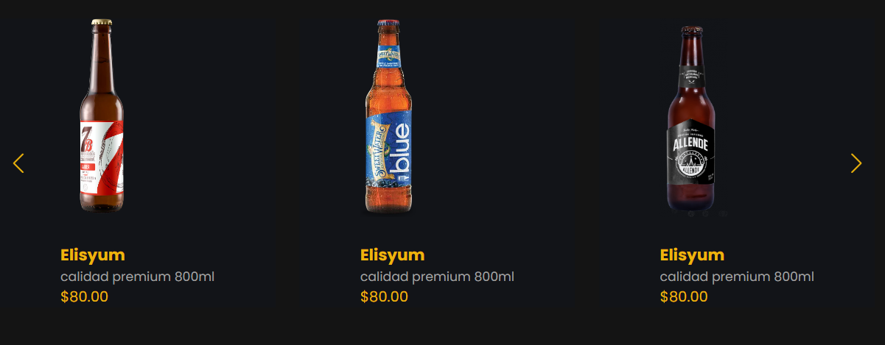

# Image carousel in Javascript

Hay dos galerías de imágenes, una muestra el producto y la otra lo describe en distintos titulos, posee una barra de navegacion modo amburgesa, que se repite en el footer con redes sociales.

> [!NOTE] https://www.youtube.com/watch?v=<VOd-IgDQuGw

## Tech Stack

**Client:** HTML, Css, JAVASCRIPT

## Screenshots

